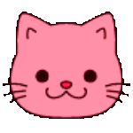

<!--banner image-->

<!--title-->
<h1 align="center"><b>Hi there, I'm <a href="https://github.com/D3PA">Giuliana Capua</a> </b>

<!--about me-->
##  About me

<!--right image-->

  

I'm a QA professional with experience in manual testing and knowledge of automation. I enjoy learning, researching, and diving into projects that challenge me. I've been training with tools like Cypress, and I adapt quickly to new technologies.

I have knowledge of SQL and work with databases such as PostgreSQL and MySQL.
I'm eager to continue growing in the QA
Automation field, always looking for ways to improve processes, optimize testing, and bring value through what I know.

I don't stay still-if there's something new to learn, I'm there. I love sharing what I discover, collaborating with teams, and continuing to grow in this tech world that I'm so passionate about.

-  I’m drawn to challenges that seem impossible.
-  Visit my [Portfolio](https://github.com/Giulicapua) for more details about me. (Under construction)
-  I’m specialized in QA Analyst
-  All of my projects are available at [GitHub](https://github.com/Giulicapua?tab=repositories)
-  Fun fact I thrive on learning new things every day.

 
 
 
 

<!--technical skills table-->

  
##  Technical Skills

<table align="center">
  <tr>
    <td align="center">
      
<b>LANGUAGES</b>

      
    </td>
    <td align="center">
      
<b>DATABASES</b>

      
    </td>
  </tr>
  <tr>
    <td align="center">
      
<b>QA / TESTING TOOLS</b>

       
    </td>
    <td align="center">
      
<b>TOOLS & OTHERS</b>

       
    </td>
  </tr>
</table>
<!--technical skills table-->

 
 

<!--connect with me-->

  
##  Connect with me

Do you want to contact me for collaboration opportunities? 

 
 

<!--github overview-->

  
##  GitHub Overview

<table width="100%">
  <tr>
    <td width="50%">
      

        
      

    </td>
    <td width="50%">
      

        
      

    </td>
  </tr>
</table>

<!-- snake purple -->

  

<!-- snake purple -->

<!--update quote at 00:00 argentina-->

##  What I’m Thinking Today

<!--TARJETA_INICIO-->

  

<!--TARJETA_FIN-->

---

<!--final-->

  
**Made with  and lots of  by Giuliana Capua**

